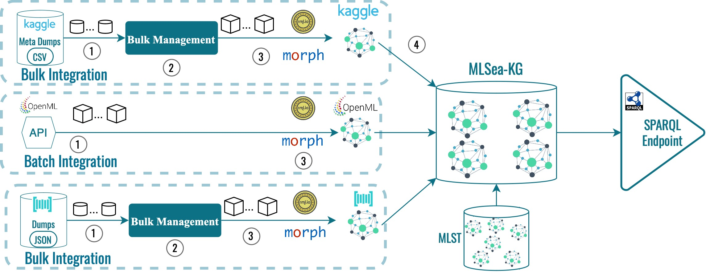

# MLSea Resource Code

 

  

This repository contains source code and RML mappings used for creating **MLSea-KG**, a **declaratively** constructed and regularly updated machine learning KG with more than **1.44 billion RDF triples** containing metadata about machine learning:
- Datasets 
- Tasks
- Implementations and related hyper-parameters 
- Experiment executions, their configuration settings and evaluation results 
- Code notebooks and repositories 
- Algorithms 
- Publications 
- Models 
- Scientists and practitioners 

The data were gathered and integrated from OpenML, Kaggle and Papers with Code.

 

# MLSea-KG Construction Process Overview 
  

 

# Data Integration

Resource code directory contains resource code used for **collecting**, **pre-processing**, **sampling** and **declaratively generating** RDF triples, using the declarative mappings included. The input data sources used are the OpenML data extracted from the OpenML API, the Meta Kaggle CSVs and the Papers with Code dumps, which are not included in this repository.
OpenML CSV dumps are also generated, to store data retrieved from the OpenML API.
 

# RML Mappings

The **RML mapping** that were used for each platform are also provided, demonstrating the rules used to declaratively construct **MLSea-KG**. Both common RML mappings and the corresponding in-memory RML mappings used to generate RDF from in-memory samples are provided, complemented by their YARRRML serialization.

 

# Querying MLSea-KG

**MLSea-KG** is accessible through our SPARQL [endpoint](http://w3id.org/mlsea-kg). The [sparql_examples](https://github.com/dtai-kg/MLSea-KGC/tree/main/sparql_examples) folder contains example queries for traversing **MLSea-KG**. 

 

# MLSea-KG Snapshots

**MLSea-KG** snapshots are available at **MLSea-KG's** [Zenodo repository](https://zenodo.org/doi/10.5281/zenodo.10287349).

 

# Resource Code Pagkage Installation

Clone the repository:

    git clone https://github.com/dtai-kg/MLSea-KGC.git

Install dependencies: 

    pip install requirements.txt

 

# Resource Code Pagkage Usage

 

**Import Original Data Sources**

- Edit 'config.py' to set the target locations where imported data sources will be stored. 
- Download Kaggle metadata through the [Meta Kaggle](https://www.kaggle.com/datasets/kaggle/meta-kaggle) dataset.
- Download Papers with Code metadata through the [Papers with Code](https://paperswithcode.com/about) dump files.
- Download OpenML metatadata and store them as CSV backups through the OpenML API service with 'openml_data_collector.py':

        python openml_data_collector.py

 

**Process RDF Mappings**

View and explore the [RDF mappings](https://github.com/dtai-kg/MLSea-KGC/tree/main/resource_code/Mappings). Make necessary changes to the input sources paths to point to the location of your local data sources. 

 

**Generate RDF dumps** 

Generate the RDF dumps of MLSea-KG by running: 

    python data_integration_openml.py
    python data_integration_kaggle.py
    python data_integration_pwc.py

 

# Cite 

Thank you for reading! To cite our resource:

    @InProceedings{dasoulas2024mlsea,
        author    = {Dasoulas, Ioannis and Yang, Duo and Dimou, Anastasia},
        booktitle = {The Semantic Web},
        title     = {{MLSea: A Semantic Layer for Discoverable Machine Learning}},
        year      = {2024}
    }